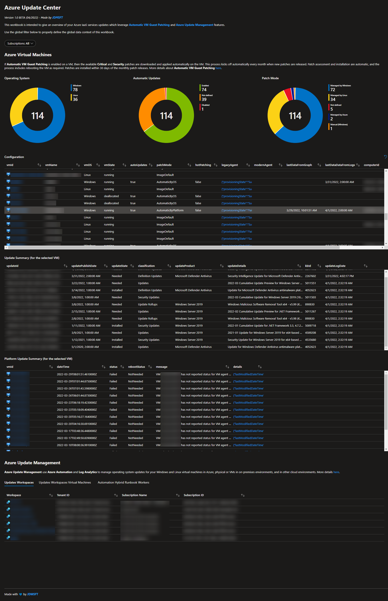

# Azure Update Center

This **Azure workbook** is intended to give an ***overview of your Azure IaaS services updates and patch configuration*** which leverage ***Automatic VM Guest Patching*** and ***Azure Update Management*** features.

I built this workbook to accelerate my customers heterogeneous patch configuration posture analysis.

The workbook has two parts:

* **Azure Virtual Machines** to see:
  * VM patch configuration (Auto Update, Patch Mode, Monitoring Agents,...)
  * Last VM update report (if onboarded in Log Analytics Updates solution) for the selected VM
  * VM platform updates (if VM deployed with AutomaticByPlatform option enabled) for the selected VM
* **Azure Update Management** to see:
  * All your workspace with an Updates solutions
  * All VMs onboarded in these workspaces
  * All your automation accounts to browse MANUALLY (but quickly) to discover Hybrid Runbook Workers nodes (or your VMs onboarded in Azure Update Management)

## How to deploy

To deploy this workbook in your Azure tenant, click on the button below:

> This deployment experience automatically handle uniqueness constraint of the Azure Workbook. You only need to provide a location where to deploy this workbook and that's it!

## Known issues & limitations

* Because we can't loop in a *Custom Endpoint* query, I can't query dynamically worker nodes. As a workaround I offer the possibility to browse your automation accounts from the **Azure Update Management** part of the workbook to show associated Hybrid Runbook Workers (System node included).